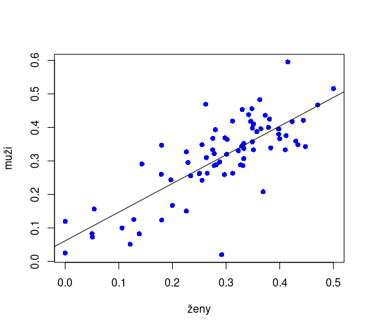
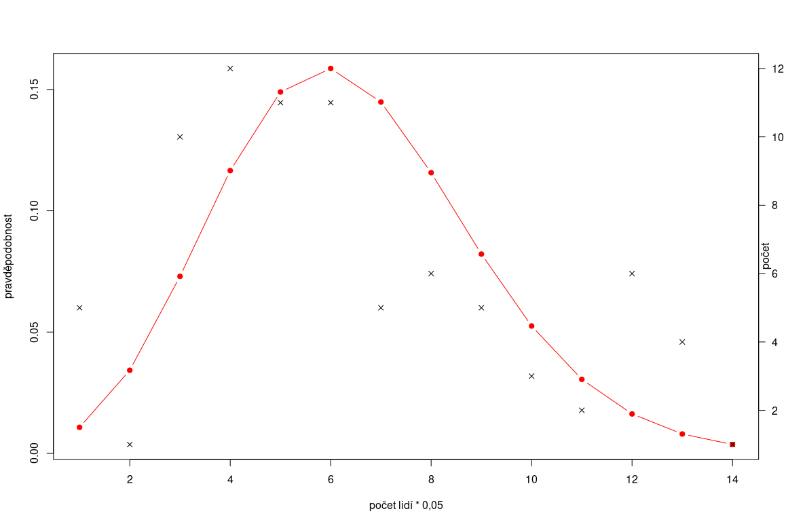

# Zápočtová úloha
## Data
Daty jsou covid statistiky litoměřické nemocnice. V github [repozitáři](https://github.com/lavakin/covid_positivity_statistics) jsou všechny skripty, která data úpraví do finální podoby. Původní data nejsou kvůli citlivým údajům zahrnuta

Všechna výsledná data, která zpracováváme v R jsou ve složce `results`.

## Lineární regrese
Jako první otestujeme, zdali koreluje procento pozitivity u mužů a žen. Všechny skripty k tomu použité jsou k vidění ve složce `gender_scripts`, mezivýsledky pak ve složce `by_gender`

### Rscript
  ```r
# linear regression
gender_data = read.delim("results/gender_ratio.txt", header = TRUE, sep = " ", dec = ".")
gender_lin = lm(zeny~muzi, data = gender_data)
plot(data$muzi, data$zeny, pch = 16, col = "blue", xlab = "ženy", ylab = "muži")
abline(gender_lin)
```
### Graf


### Výsledky  lineární regrese
```r
> summary(gender_lin)

Call:
lm(formula = zeny ~ muzi, data = gender_data)

Residuals:
      Min        1Q    Median        3Q       Max 
-0.291343 -0.039050 -0.006701  0.045372  0.183334 

Coefficients:
            Estimate Std. Error t value Pr(>|t|)    
(Intercept)  0.06142    0.02444   2.513   0.0141 *  
muzi         0.85589    0.07849  10.904   <2e-16 ***
---
Signif. codes:  0 ‘***’ 0.001 ‘**’ 0.01 ‘*’ 0.05 ‘.’ 0.1 ‘ ’ 1

Residual standard error: 0.0747 on 75 degrees of freedom
  (1 observation deleted due to missingness)
Multiple R-squared:  0.6132,	Adjusted R-squared:  0.608 
F-statistic: 118.9 on 1 and 75 DF,  p-value: < 2.2e-16
```
Hodnota p je <2.2 * 10^16 pro 0,1\% hladinu významnosti, můžeme tedy hypotézu zamítnout a předpokládat, že je mezi daty s 99\% pravděpodobností lineární vztah.

## Poissonovo rozdělení
Nyní budeme zkoumat, kolik můžeme očekávat lidí v jednom dni a zdali se toto řídí poissonovým rozdělením. K ověření použijeme test dobré shody mezi očekávanými hodnotami a mezi hodnotami naměřenými.

Všechny použité skripty pro spracování jsou k dispozici ve složce `by_visits_scripts`. Všechny mezivýsledky pak ve složce `by_visits`
### Provedení
Data jsme rozdělili po 20, kvůli nedostatku dat (20-40,40-60,...). Data jsou 20 vydělena, aby se s nimi snáze pracovalo. Výsledkem je 14 nenulových řádků.

Nejprve vypočítáme průměr z naměřených dat. Poté pomocí bashového skriptu sloučíme stejná data a spočítáme jejich počet. Vypočítáme teoreticou hodnotu poissonova z vypočítaného průměru a vytvpříme graf

### Rscript
```r
by_visits_data = read.delim("results/by_visits.txt", header = TRUE, sep = " ", dec = ".")
by_visits2_data = read.delim("results/by_visits2.txt", header = TRUE, sep = " ", dec = ".")
lambda = mean(by_visits2_data$val)
occ = by_visits_data$occ
pois = dpois(1:13, lambda)
pois[14] = 1 - sum(pois)
plot(pois, type = "b", pch = 19, col = "red", xlab="počet lidí * 0,05", ylab="pravděpodobnost")
par(new = TRUE)
plot(by_visits_data$occ, axes = FALSE, xlab = "", ylab = "", pch=4)
axis(side=4, las=1)
mtext("počet", side=4)
```
### Graf


### Věrohodnost
Následně provedeme chi-square test
```r
 chisq.test(x=occ, y=1:14, p=pois)

	Pearson's Chi-squared test

data:  occ and 1:14
X-squared = 112, df = 104, p-value = 0.2786
```
p-value je tedy 0,279. Hypotézu tedy přijmeme i pro 5\% hladinu významnosti. To znamená, že se nemůžeme s velkou jistotou domnívat, že se počet klientů za den řídí poissonovým rozdělením.
